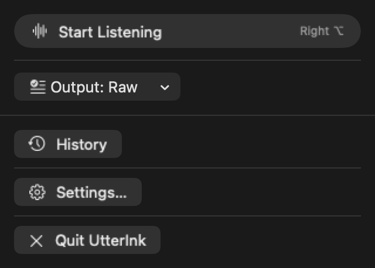
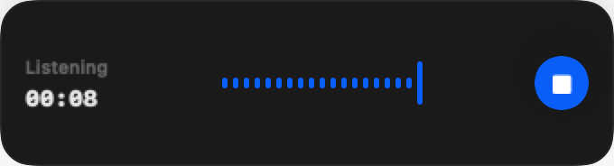

# UtterInk

<p align="center">
  <picture>
    <source media="(prefers-color-scheme: dark)" srcset="docs/assets/wordmark-lockup-dark.svg">
    <source media="(prefers-color-scheme: light)" srcset="Brand/wordmark-lockup.svg">
    
  </picture>
</p>

<p align="center">
  <strong>Private, local-first dictation for macOS.</strong><br>
  Speak, transcribe on your Mac, and safely deliver text where you are writing.
</p>

<p align="center">
  <a href="https://github.com/kthree0213/UtterInk/releases/tag/v0.1.0">Download v0.1.0</a>
  · <a href="README.zh-CN.md">简体中文</a>
  · <a href="PRIVACY.md">Privacy</a>
</p>

UtterInk is an open-source macOS menu-bar app for local Whisper dictation. Raw
dictation stays on this Mac. If you opt into AI polishing, UtterInk sends only
the transcript text—not audio—to the provider you configure.

## See It in Action

https://github.com/user-attachments/assets/c27014fa-d36e-432e-8208-b0319be07908

<p align="center"><sub><strong>30-second overview.</strong> Local dictation, safe delivery, and one spoken thought shaped by built-in or custom output modes.</sub></p>

### Product Interface

<p align="center">
  
</p>

<p align="center"><sub><strong>Compact menu.</strong> Start listening, switch output mode, or recover recent text.</sub></p>

<p align="center">
  
</p>

<p align="center"><sub><strong>Recording overlay.</strong> A live waveform and timer stay visible without taking keyboard focus.</sub></p>

_Screenshots are generated from isolated fake-data UI tests and contain no user content._

## Features

- **Fast global capture.** Right Option is the default recorder shortcut; custom shortcuts, Toggle, and Hold to Talk are also supported.
- **Local speech recognition.** WhisperKit transcribes after recording stops, with Fast, Recommended, and Best Quality model choices.
- **Focused recording UI.** The optional always-visible overlay shows listening, processing, success, and recoverable-error states without becoming the frontmost typing target.
- **Safe delivery.** Choose guarded Automatic Paste or Copy Only. When a target cannot be validated, the text remains available to copy or paste again.
- **Useful output modes.** Raw is the default, alongside five built-in AI polishing modes and editable custom modes.
- **Local recovery.** History can keep up to 20 text-only sessions with Copy, Paste Again, per-item Delete, and Clear History controls.

## Quick Start

1. Download the signed and notarized `UtterInk-0.1.0-arm64.dmg` from the [v0.1.0 release](https://github.com/kthree0213/UtterInk/releases/tag/v0.1.0), open it, and drag UtterInk to Applications.
2. Complete onboarding: allow Microphone access, optionally allow Accessibility for the global shortcut and Automatic Paste, then choose a recognition language and speech model.
3. For the best starting balance, choose **Recommended** (`small`, approximately 489 MB) and confirm the download. UtterInk does not start a new model download until you approve it.
4. Focus a text field, press **Right Option** once to start, speak, then press it again to stop. The default shortcut behavior is Toggle and can be changed in **Settings → Shortcuts**.
5. Wait for local transcription. With Automatic Paste enabled, UtterInk attempts to deliver the result to the original field; otherwise use the explicit Copy recovery action.

Raw dictation needs no API key. To enable AI polishing, follow [Optional AI Polishing](#optional-ai-polishing).

## Privacy Summary

- **Local Whisper transcription.** UtterInk records a short-lived local CAF for the active session and transcribes it on this Mac with WhisperKit after you stop recording.
- **No audio retention.** Audio is not stored in history or sent to a text-polishing provider. The common cleanup path deletes the temporary file, and launch and pre-capture sweeps remove crash or power-loss orphans. Normal APFS deletion is best-effort cleanup, not guaranteed secure erasure.
- **Text-only 20-session history.** History is on by default and keeps at most 20 text-only sessions, including raw and final text, under `~/Library/Application Support/UtterInk`.
- **Optional text egress.** Raw mode uses no text provider. Optional OpenAI-compatible polishing sends the selected model ID, saved instructions, raw transcript text, and, when configured, an authorization credential to the host shown in Settings; it never sends audio.
- **Protected credentials.** Provider API keys are stored per profile in macOS Keychain rather than normal settings or history.
- **No analytics. No cloud sync.** The current source has no analytics or tracking SDK. Diagnostics contain only allowlisted operational fields and are exported only after you preview them and choose a save location.

See [Privacy](PRIVACY.md) and the [privacy data flow](docs/privacy-data-flow.md) for the complete boundaries and deletion caveats.

## Optional AI Polishing

Raw is selected by default and works without a provider or credential. The built-in choices are:

| Mode | What it does | Sends transcript text to a provider? |
| --- | --- | --- |
| **Raw** | Returns the local transcript unchanged | No |
| **Clean Up** | Removes filler and fixes punctuation while preserving meaning | Yes |
| **AI Prompt** | Structures spoken ideas into a clearer prompt for an AI tool | Yes |
| **Translate to English** | Returns a direct English translation | Yes |
| **Work Message** | Rewrites text as concise, professional workplace communication | Yes |
| **Classical Chinese** | Rewrites the text in literary Chinese | Yes |
| **Custom** | Uses instructions you create and edit | Yes |

To configure polishing:

1. Open **Settings → Provider** and select a provider template. Choose **Custom** only when you need to enter your own OpenAI-compatible base URL.
2. Enter the API key, review the normalized destination host, and choose **Test Key & Load Models**. Remote hosts require HTTPS; plain HTTP is accepted only for an explicitly selected canonical loopback host on the same Mac.
3. Select a compatible model returned by the provider, then choose **Save & Use**. The API key is stored in macOS Keychain; it is not placed in ordinary settings, History, or diagnostics.
4. Open **Settings → Output Modes** and select a built-in or custom mode. Keep **Raw** selected when no transcript text should leave the Mac.

For a polishing request, UtterInk sends the model ID, saved instructions, and raw transcript in a `POST /chat/completions` request. When the profile has an API key, it is sent as a Bearer credential. Audio is never sent. The provider and network remain subject to their own privacy and retention policies.

## Speech Models

Speech weights are not bundled in the repository or app. UtterInk asks for confirmation before downloading a missing model and marks models that are already available locally.

| In-app choice | Model ID | Approximate catalog size | Suggested use |
| --- | --- | ---: | --- |
| **Fast** | `base` | 149 MB | Smallest download and quickest setup |
| **Recommended** | `small` | 489 MB | Best starting balance for most users |
| **Best Quality** | `large-v3` | 3.1 GB | Higher-quality recognition when disk use is acceptable |

Models are downloaded from pinned Hugging Face revisions and cached under `~/Library/Application Support/UtterInk/huggingface`. Settings can delete a cached model only while it is not selected, preparing, loaded, or leased by an active operation.

## Requirements

- macOS 14 deployment target
- Apple Silicon / arm64 only
- An internet connection for the first download of a selected speech model and tokenizer
- For the documented source workflow: Xcode 26.4.1 build 17E202, Apple Swift 6.3.1, and XcodeGen 2.45.4

An internet connection is not required for Raw transcription after the selected model is cached. Optional AI polishing requires access to the provider you configure.

## Install a Release

UtterInk v0.1.0 is publicly available as a Developer ID signed and Apple-notarized DMG on [GitHub Releases](https://github.com/kthree0213/UtterInk/releases/tag/v0.1.0).

Download the DMG together with `SHA256SUMS`. Compare the output of `shasum -a 256 UtterInk-0.1.0-arm64.dmg` with the matching line in `SHA256SUMS`; alternatively, download all five release assets and run the full verification command in the release notes. Stop if the checksum does not match. Then open the DMG and drag UtterInk to Applications.

Speech models are downloaded separately on first use and are not bundled in the DMG.

## Permissions

- **Microphone — required for recording.** Audio is used for local transcription.
- **Accessibility — optional for local transcription, required for the complete global workflow.** It enables the global shortcut, precise target validation, and guarded Automatic Paste. Explicit Copy remains available without it.

Permission state can be reviewed in Settings. UtterInk does not need Accessibility permission merely to transcribe locally.

## History and Recovery

History is on by default. It stores the newest 20 raw/final text sessions locally in `history-v1.json`; it never stores audio. When history is enabled, UtterInk saves the raw transcript before optional remote polishing so a provider or delivery failure does not lose the original text.

Turning History off immediately blocks new persistent writes and invalidates History writes already in flight, but it does not delete entries already saved. Use per-session **Delete** or **Clear History** to remove them. Results created while History is off remain in memory only and disappear when UtterInk quits.

Automatic Paste temporarily holds an in-memory snapshot of the current pasteboard, capped at 16 MiB and a 0.5-second capture window. UtterInk attempts a guarded restore only if the pasteboard is unchanged; the platform restore can still fail, and the snapshot is not written to app storage. `NSPasteboard` has no atomic compare-and-write or compare-and-restore operation, so another copy in either small check/action interval can still be overwritten. Copy Only and explicit Copy intentionally replace the clipboard and do not restore it. If delivery cannot complete safely, the result remains available for recovery.

## Build from Source

Use XcodeGen 2.45.4, generate the project, and keep build products outside the checkout. The subshell preserves a failed build status while still removing its scratch directory:

```bash
(
  set -e
  test "$(xcodegen --version | sed 's/^Version: //')" = '2.45.4'
  xcodegen generate
  BUILD_ROOT="$(mktemp -d "${TMPDIR:-/tmp}/utterink-readme-build.XXXXXX")"
  trap 'status=$?; trap - EXIT; rm -rf -- "$BUILD_ROOT" || status=$?; exit "$status"' EXIT
  xcodebuild \
    -project UtterInk.xcodeproj \
    -scheme UtterInk \
    -configuration Debug \
    -destination 'platform=macOS,arch=arm64' \
    -derivedDataPath "$BUILD_ROOT/DerivedData" \
    -clonedSourcePackagesDirPath "$BUILD_ROOT/SourcePackages" \
    CODE_SIGNING_ALLOWED=NO \
    build
)
```

You can also open `UtterInk.xcodeproj` and run the `UtterInk` scheme from Xcode. On first launch, choose and download a speech model in onboarding or Settings.

## Test

Run the Swift package tests:

```bash
(
  set -e
  PACKAGE_TEST_ROOT="$(mktemp -d "${TMPDIR:-/tmp}/utterink-package-test.XXXXXX")"
  trap 'status=$?; trap - EXIT; rm -rf -- "$PACKAGE_TEST_ROOT" || status=$?; exit "$status"' EXIT
  swift test \
    --package-path Packages/UtterInkKit \
    --scratch-path "$PACKAGE_TEST_ROOT/UtterInkKit-build" \
    --disable-sandbox \
    --force-resolved-versions
)
```

Run the app unit tests without UI automation:

```bash
(
  set -e
  test "$(xcodegen --version | sed 's/^Version: //')" = '2.45.4'
  xcodegen generate
  APP_TEST_ROOT="$(mktemp -d "${TMPDIR:-/tmp}/utterink-app-test.XXXXXX")"
  trap 'status=$?; trap - EXIT; rm -rf -- "$APP_TEST_ROOT" || status=$?; exit "$status"' EXIT
  xcodebuild \
    -project UtterInk.xcodeproj \
    -scheme UtterInk \
    -configuration Debug \
    -destination 'platform=macOS,arch=arm64' \
    -derivedDataPath "$APP_TEST_ROOT/DerivedData" \
    -clonedSourcePackagesDirPath "$APP_TEST_ROOT/SourcePackages" \
    -parallel-testing-enabled NO \
    CODE_SIGNING_ALLOWED=NO \
    test \
    -only-testing:UtterInkAppTests
)
```

Run the repository's complete local verification, including directed UI smoke tests:

```bash
./Scripts/ci-local.sh
```

## Unsigned Package

The source command above produces an unsigned development build. It is not notarized or intended for redistribution. Official signed builds are published only on the GitHub Releases page linked above.

The fail-closed packaging path below requires the reviewed `Config/ci-toolchain.json` lock, which is committed with its reviewed source identities and hashes. Contributors can run the same verification path without Apple credentials; any toolchain or generated-project drift fails closed:

```bash
(
  set -e
  trap 'status=$?; trap - EXIT; ./Scripts/clean-distribution-output.sh || status=$?; exit "$status"' EXIT
  ./Scripts/bootstrap-xcodegen.sh
  UTTERINK_EXPECTED_ORIGIN='https://github.com/kthree0213/UtterInk.git' \
    ./Scripts/ci-local.sh --unsigned-package-smoke
)
```

Keep the expected origin byte-for-byte identical to the separately reviewed canonical `origin`; if the checkout intentionally has no remote, omit `UTTERINK_EXPECTED_ORIGIN`. Any output is named `UNSIGNED-DO-NOT-DISTRIBUTE`, must remain local, and is removed by the exit cleanup. Signing, notarization, final verification, and publication are separate maintainer phases documented in [Releasing](docs/RELEASING.md); none is authorized by running these commands.

## Current Limitations

- Apple Silicon / arm64 only; there is no Intel build.
- The interface is currently English; speech-recognition selection is Automatic or fixed English.
- No live or streaming transcription; transcription begins after recording stops.
- UtterInk has no automatic updater. Install future releases manually from GitHub Releases.
- There is no cloud sync; settings and history remain local to this Mac.
- No API keys are bundled. Optional providers require a user-supplied credential, except an explicitly configured keyless loopback service.
- Model downloads are large, remain cached until deleted, and have no automatic eviction.
- Audio cleanup and history deletion use normal filesystem deletion and do not guarantee secure erasure.
- A per-item History deletion can disappear from the current UI even if its persistent deletion fails; the failure is recorded as a sanitized local diagnostic, and the item can reappear after relaunch.
- When the target or clipboard changes, Automatic Paste aborts or attempts the guarded recovery described above; the platform restore can still fail, while the text result remains recoverable from the latest result or history view.
- The v0.1.0 deployment target is macOS 14, while clean-machine release acceptance was performed on macOS 26; older supported macOS versions did not receive the same separate physical-Mac acceptance pass.

## Contributing and Security

Before contributing, read [Contributing](CONTRIBUTING.md), the [Code of Conduct](CODE_OF_CONDUCT.md), and the [trademark policy](TRADEMARKS.md).

Report suspected vulnerabilities privately to `swallowclever.k3@gmail.com` and follow [Security](SECURITY.md). Do not include credentials, transcripts, or other sensitive data in a public issue. The same address is the approved Code of Conduct enforcement contact.

## License

UtterInk source code is licensed under [Apache-2.0](LICENSE), copyright 2026 kthree0213. The source license does not grant rights to the UtterInk name, logo, icon, or other brand identifiers; see [TRADEMARKS.md](TRADEMARKS.md).

Dependency licenses and runtime-downloaded model notices are recorded in [THIRD_PARTY_NOTICES.md](THIRD_PARTY_NOTICES.md). Redistribution must preserve the applicable [NOTICE](NOTICE) material.
