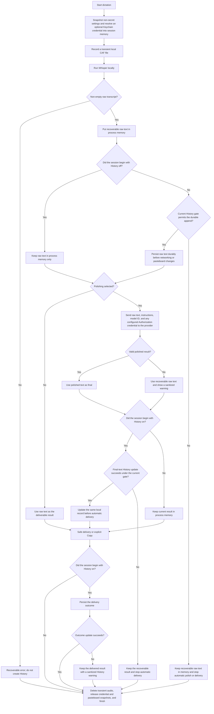

# UtterInk Privacy Data Flow

This document maps one UtterInk dictation from capture through cleanup. A session that begins with History off can use a memory-only recovery path. A session that begins with History on must persist its raw transcript before any provider request or automatic delivery; turning History off is an immediate override that invalidates a write already in flight and stops that automatic pipeline.

## 1. Session snapshot and permissions

UtterInk begins only when the selected local Whisper model is ready. It snapshots ordinary session settings so a mid-session edit cannot silently change the active operation. History is the privacy exception: every persistent write must also pass the current History generation and privacy gate, so turning History off overrides the value captured at session start and invalidates writes already in flight. If polishing is selected, UtterInk resolves the provider credential from macOS Keychain into a non-printable in-memory session wrapper. The persistent credential remains a Keychain item; the in-memory copy is released during terminal cleanup.

Microphone access is required for capture. Accessibility is used to validate the exact external target and perform guarded automatic paste. Missing Accessibility does not prevent local transcription or an explicit Copy.

## 2. Transient local capture

The recorder creates an opaque UUID-named `.caf` file in a private, user-only, backup-excluded UtterInk directory. The file exists long enough to finalize recording and perform local transcription. It is never included in History, diagnostics, or a polishing request.

The normal terminal cleanup path deletes the transient file after success, cancellation, or failure. UtterInk also sweeps orphan files at app launch and before each new capture to handle crashes or power loss. This is ordinary APFS file deletion, not guaranteed forensic secure erasure; snapshots, backups, SSD behavior, or storage failure can affect recoverability.

## 3. Local transcription and the recoverable-raw boundary

Whisper transcribes the finalized audio locally. Empty or whitespace-only output becomes a recoverable error and is not added to History.

A non-empty raw transcript first enters process memory. Persistence then passes through the current History privacy generation and gate:

- **Session began with History on:** UtterInk writes the raw record to its local History store and requires that write to succeed before any provider request or automatic pasteboard change. Turning History off before or during that append increments the privacy generation and invalidates the write. Automation then stops; the in-memory raw result remains available for explicit Copy.
- **Session began with History off:** UtterInk performs no persistent History write and can continue the memory-only pipeline. The raw result disappears when the app process exits, and UtterInk keeps at most 20 such results.

This distinction is deliberate: the data flow is **recoverable raw first**, not “every raw transcript is durable.”

## 4. Optional provider egress

Raw mode makes no transcript-polishing request. If the selected output mode enables polishing, UtterInk sends the following to the exact configured provider endpoint:

- Raw transcript text.
- Resolved polishing instructions.
- Selected provider model identifier.
- The provider credential in the Authorization header, when one is configured.
- Ordinary connection metadata inherent to a network request.

Audio is never sent. The UI displays the normalized destination host. Remote endpoints require HTTPS; only an explicitly configured canonical loopback address on the same Mac can use HTTP. Redirects cannot forward a credential to another origin.

Provider failure, timeout, invalid output, or a sanitized protocol error falls back to the recoverable raw transcript with a visible warning. It does not require audio retranscription because no audio recovery feature exists.

Model download and an explicit provider connection test are separate network paths. A connection test can authenticate but does not send transcript text. Whisper model/tokenizer downloads send requested model identifiers and normal network metadata to the model host, not microphone audio or transcript content.

## 5. Final-text update

In Raw mode, the already-persisted raw record is also the final text, so UtterInk proceeds directly to delivery without a redundant pre-delivery update. When a History-on session uses polishing or raw fallback, UtterInk updates the same original-session record before automatic delivery. Turning History off before that update invalidates it just like a storage failure: the already-saved raw text remains authoritative, polished or fallback text remains only in memory, and automatic delivery stops in favor of an explicit recovery action.

When a session begins with History off, raw and final variants remain process-memory-only and the pipeline can continue without a durable record. History retains the newest 20 non-empty original sessions rather than counting polishing retries as new dictations.

## 6. Safe delivery

Automatic paste is one guarded transaction:

1. Capture every immediately readable pasteboard item/type plus the starting change count, bounded to 16 MiB and 500 ms.
2. Abort without changing the pasteboard if the snapshot is incomplete, oversized, unreadable, or timed out.
3. Revalidate the intended external process, window, and focused editable element.
4. Confirm that the pasteboard has not changed, write the result, and record UtterInk's new change count. `NSPasteboard` has no atomic compare-and-write operation, so a copy in the small interval between this check and write can still be overwritten.
5. Revalidate the target and dispatch process-addressed Command-V.
6. After a bounded 250 ms interval, attempt to restore the exact previous pasteboard only if UtterInk still owns the same change count. The platform restoration call can still fail, and a copy in the small interval between this ownership check and restore can still be overwritten.

Dispatch or cancellation failures use the same guarded restore attempt. Change-count checks protect a copy already visible before each check; they cannot make the subsequent write or restore atomic. Both small race windows described above remain. UtterInk does not deliberately write the in-memory snapshot to its logs, diagnostics, or History, and releases it after cleanup. Memory release is not represented as secure erasure.

An explicit **Copy** or **Copy Only** is different: it intentionally replaces the pasteboard and leaves the transcript there. UtterInk reports that a paste event was safely dispatched, not that every target application necessarily accepted the text.

After the delivery service returns, a session that began with History on attempts to persist its delivery outcome. If that post-delivery update fails or History has since been disabled, UtterInk does not repeat delivery; it completes cleanup with the delivered result and a sanitized History warning. A session that began with History off skips this durable outcome update.

## 7. Terminal cleanup and retained local data

Every terminal path attempts to:

- Delete the transient audio file.
- Clear and release the in-memory provider credential wrapper.
- Release any pasteboard snapshot and delivery lease.
- Finish with either a recoverable result or a sanitized error/outcome code.

After cleanup, the following may remain by design:

- Up to 20 local text History records when History is on.
- Up to 20 process-memory-only text results until quit when History is off.
- User-selected provider profile settings locally, with the credential in Keychain.
- Downloaded Whisper model and tokenizer caches until an eligible user-requested deletion.
- Allowlisted local system-log entries and any diagnostic JSON the user explicitly exported.

Target app identity, transient window titles, transcript text, audio, provider credentials, polishing instructions, pasteboard contents, raw errors, and full provider URLs are excluded from diagnostics. Target details are not persisted in History.

## 8. Disable, clear, and deletion semantics

Turning History off immediately prevents both new and stale in-flight operations from writing records, but it does not delete records already saved. **Clear History** is the separate destructive control: it confirms, cancels an active session, removes persistent History and completed volatile results, and invalidates stale writes. Per-item deletion uses the same anti-resurrection protection for that session.

History storage uses atomic local transactions, which can temporarily create journal, replacement, or backup artifacts. History clear, item deletion, model deletion, and orphan-audio cleanup are ordinary filesystem operations. They can fail, and APFS deletion does not guarantee that data is physically unrecoverable. A per-item History deletion failure is recorded only as a sanitized local diagnostic in the current implementation; the row is not restored in the current UI and can reappear after relaunch if the persistent record remained.

## 9. No automatic collection or upload

UtterInk has no analytics service, no cloud sync, and no automatic diagnostic upload. A diagnostic export is created only at the user's request and is restricted to an allowlist of app/build, OS/architecture, permission states, model ID/state, normalized provider host/model, sanitized pipeline/status codes, and History enabled/count. It excludes user content and secrets.

The transient-audio directory is backup-excluded. Other Application Support data can still be handled by macOS or user-configured backup software according to those systems' settings.

See the public [privacy document](../PRIVACY.md) for the complete data inventory and controls.
